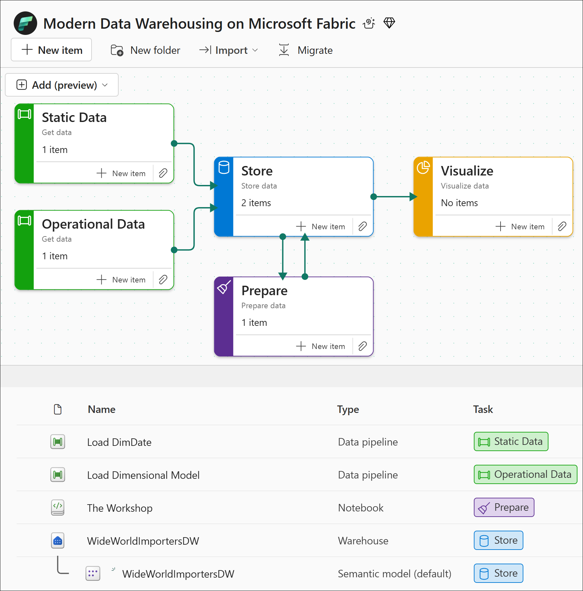
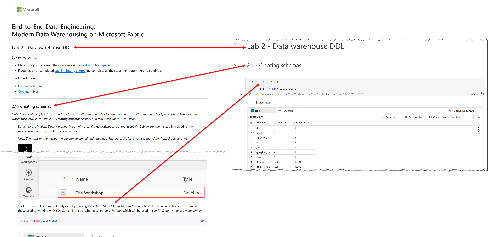

# End-to-End Data Engineering:   Modern Data Warehousing on Microsoft Fabric

All lab content can be found at [https://aka.ms/FabConDW](https://aka.ms/FabConDW).

In today’s data-driven world, the ability to efficiently manage and analyze vast amounts of data is crucial for business success. This full-day hands-on workshop will explore the comprehensive capabilities of Fabric data warehouse, highlighting how it enables seamless end-to-end data engineering. 

You will learn about data ingestion, storage, transformation, analysis as well as monitoring and managing a data warehouse within the Microsoft Fabric ecosystem. We will delve into real-world use cases, demonstrating how organizations can leverage Fabric data warehouse to drive insights and innovation. Whether you’re a DBA, data engineer, analyst, or IT professional, this session will provide you with practical skills to enhance your data engineering capabilities with Microsoft Fabric. 

At the end of this workshop, you will have gained practical experience in building robust, scalable, and efficient data solutions on Microsoft Fabric data warehouse. 

## Learning Objectives

In this workshop you will learn:

- A common pattern for building a medallion architecture using the data warehouse in Fabric
- Creating and interacting with the data warehouse in Fabric
- Create objects in a warehouse including schemas, tables, and stored procedures
- Methods for loading a data warehouse using no-code, low-code, and code-first approaches
- Techniques for transforming data which will handle incremental loading
- Orchestrating and scheduling warehouse operations using Fabric Data Factory
- Monitoring warehouse operations with DMVs, query insights, and the Fabric portal
- Time travel to view historical versions of a table or query
- Clone warehouse tables without needing to create additional data copies

## Prerequisites

Microsoft will provide:
- A Fabric environment (including tenant, capacity, and workspace) for the **day of the workshop only**. 

Attendees will need to provide:
- Computer with an internet connection

## Solution overview

Over the course of the seven labs in this workshop you will build the workflow shown below. Source data is stored in an Azure storage account with static copies of several tables. The dataset being used in the [Wide World Importers DW](https://learn.microsoft.com/en-us/sql/samples/wide-world-importers-dw-install-configure?view=sql-server-ver16&tabs=sql-server) sample dataset from Microsoft. 

The labs will walk you through each click to ingest, store, and transform the data from individual tables into a dimensional model complete with stage tables, a dimensional model, surrogate keys, business keys, unknown members, and incremental loading logic. 

The goal of this workshop is to teach the pattern not the dataset. As such, we will be using copies of the final dimensional model data as our source rather than providing the transactional tables as the source. For example, to create the stock item table you may need to join four different tables together. Rather than requiring you to join four transactional tables we will be using one, already unified, table of data. 

Additionally, the focus of this workshop is on the data warehouse. Therefore, while we do use other Fabric workloads, Data Factory for pipelines, we will not apply all the best practices for building robust, fault tolerant, dynamic pipelines. 

Finally, do know that the methods and patterns presented in this workshop are not the only way to accomplish building a modern data warehouse solution. Some implementations will split stage and the dimensional model into separate warehouses. Others will use type 2 dimensions instead of type 1. This workshop presents all the data being transformed at the same time, while real world solutions may need tables to be loaded at different intervals. 

## Workshop Labs

It is recommended that you complete the labs in the order presented and do not skip ahead. Each lab builds on the work completed in prior labs. 

<table style="tr:nth-child(even) {background-color: #f2f2f2;}; text-align: left; display: table; border-collapse: collapse; border-spacing: 5px; border-color: gray;">
    <tr>
        <td style="background-color: AliceBlue; color: black;"><b>Lab</b></td>
        <td style="background-color: AliceBlue; color: black;"><b>Topics</b></td>
    </tr>
    <tr>
        <td><a href="labs/00 - Lab environment setup.md" >00 - Lab environment setup</a></td>
        <td>Configure your Fabric environment including creating a workspace, assigning capacity, and creating your first data warehouse.</td>
    </tr>    
    <tr>
        <td><a href="labs/01 - Getting started.md" >01 - Getting started</a></td>
        <td>Explore the Fabric data warehouse user interface, run queries, connect to the warehouse with client tools, and work with T-SQL notebooks.</td>
    </tr>
    <tr>
        <td><a href="labs/02 - Data warehouse DDL.md" >02 - Data warehouse DDL</a></td>
        <td>Work with schemas, create tables, and interact with the system metadata tables.</td>
    </tr>
    <tr>
        <td><a href="labs/03 - Loading data.md" >03 - Loading data</a></td>
        <td>Bring data into the warehouse using a variety of methods that range from no-code with Data Factory to code-first with T-SQL.</td>
    </tr>
    <tr>
        <td><a href="labs/04 - Data transformation using T-SQL.md" >04 - Data transformation using T-SQL</a></td>
        <td>Build stored procedures that handle unknown dimension members, load the dimensional model, and are capable of incrementally loading tables.</td>
    </tr>
    <tr>
        <td><a href="labs/05 - Orchestrating warehouse operations.md" >05 - Orchestrating warehouse operations</a></td>
        <td>Operationalize the data warehouse load by building and scheduling a pipeline and watch data flow in real time.</td>
    </tr>
    <tr>
        <td><a href="labs/06 - Advanced query techniques.md" >06 - Advanced query techniques</a></td>
        <td>See new capabilities like replaying transaction history and recovering data.</td>
    </tr>
    <tr>
        <td><a href="labs/07 - Data warehouse management.md" >07 - Data warehouse management</a></td>
        <td>Monitor data warehouse operations using a variety of tools available directly in the Fabric warehouse experience.</td>
    </tr>
</table>

## Notebook based experience

To make the lab experience more seamless, we have created a T-SQL notebook which contains all the code you will run in labs 2 through 7. This will prevent you from needing to copy/paste/select/run each code snippet and hopefully reduce problems along the way.

The notebook is structured the same way as the GitHub repo:

- GitHub: **Lab -> Section -> Step**
- Notebook: **Lab -> Section -> Cell**

## Get started

With all the background out of the way, it's time to get to the fun part!

Head over to [Lab 1 - Getting started](<labs/01 - Getting started.md>)
