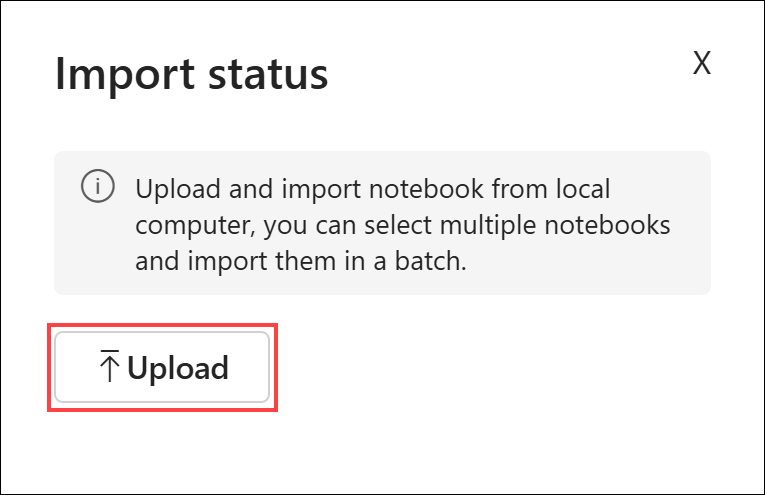
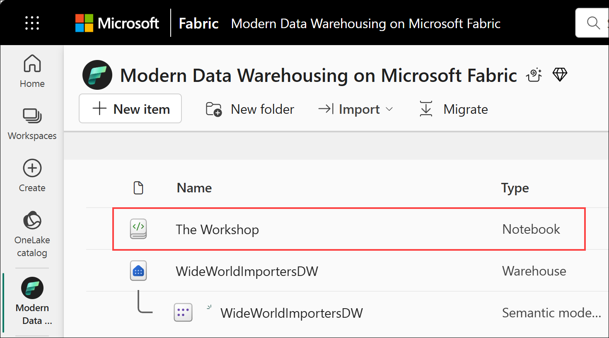
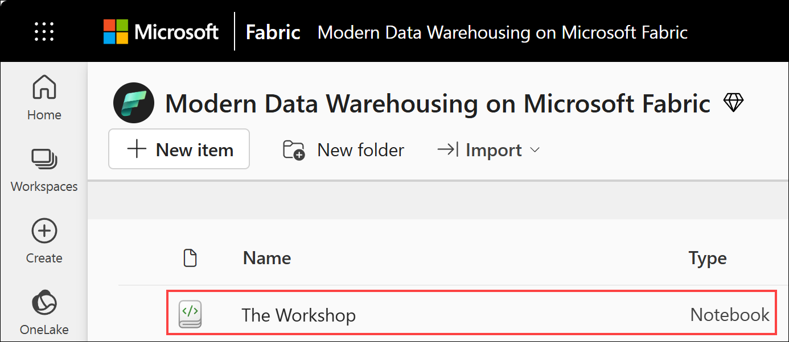
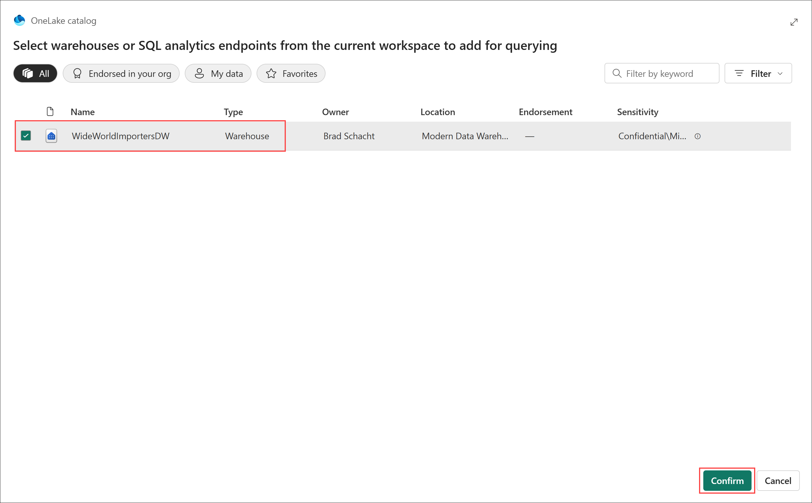

# End-to-End Data Engineering: <br> Modern Data Warehousing on Microsoft Fabric

Before you being:

- Make sure you check out the [prerequisites](00.md).

This lab will cover:

- <a href="#1.1">Exploring the Fabric UX</a>
- <a href="#1.2">Using client tools</a>
- <a href="#1.3">T-SQL notebooks</a>

<hr>

<h3 id="1.1">1.1 - Exploring the Fabric UX</h3>
Something

<h3 id="1.2">1.2 - Using client tools</h3>
Something

<h3 id = "1.3">1.3 - T-SQL notebooks</h3>

1. Return to the *Modern Data Warehousing on Microsoft Fabric* workspace created in Lab 0 by selecting the **workspace icon** from the left navigation bar. 

    *Note: The icons on the navigation bar can be pinned and unpinned. Therefore, the icons you see may differ from the screenshot.*

    

1. From the <b>Import</b> menu located just below the workspace name, select <b>Notebook -> From this computer</b>.

    

1. From the **Import status** pane on the right side of the screen, select **Upload**.

    

1. Locate and select the **The Workshop.ipynb** file on your computer. Select **Open**.

    

1. The notebook will be uploaded and appear in the workspace.

    

1. From the item list, select **The Workshop** notebook.

    

1. From the **Explorer** select **Add**.

    

1. From the list of items in the OneLake catalog select the **WideWorldImportersDW** data warehouse. Then select **Confirm**. The WideWorldImportersDW will now be associated with the notebook and will be the default connection for any queries that are run from the notebook.

    

1. Validate the notebook is indeed connected to the proper database by running the cell for **Step 1.3.9** in *The Workshop* notebook and comparing the results to those in the screenshot below.

    ``` sql
    SELECT DB_NAME() AS DatabaseName
    ```

    

## Next steps
In this lab you explored many ways to interact with the Fabric data warehouse including the web browser, connecting client tools, and notebooks. This workshop mainly uses notebooks to prevent needing to copy/paste code between windows. 

- Continue to [Lab 2 - Data warehouse DDL](<02 - Data warehouse DDL.md>)
- Return to the [workshop homepage](<../README.md>)

## Additional Resources
- [T-SQL support in Microsoft Fabric notebooks](https://learn.microsoft.com/en-us/fabric/data-engineering/author-tsql-notebook)
- [View data in the Data preview in Microsoft Fabric](https://learn.microsoft.com/en-us/fabric/data-warehouse/data-preview)
- [Query using the SQL query editor](https://learn.microsoft.com/en-us/fabric/data-warehouse/sql-query-editor)
- [Query using the visual query editor](https://learn.microsoft.com/en-us/fabric/data-warehouse/visual-query-editor)