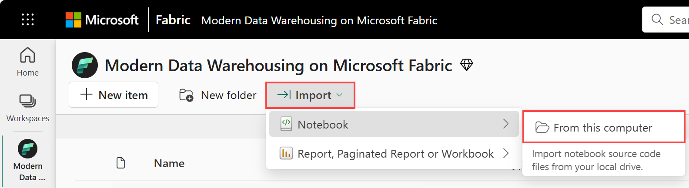
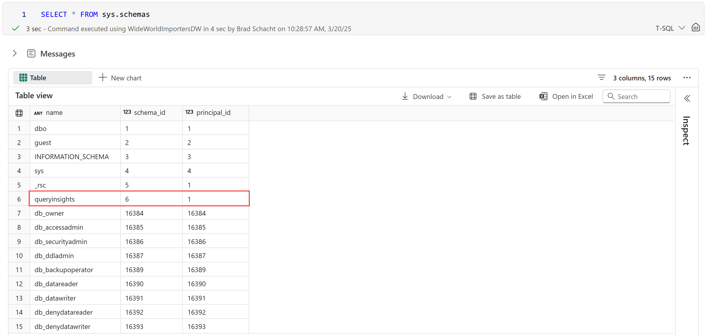
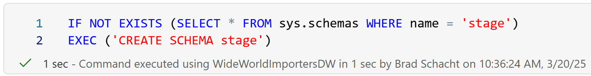
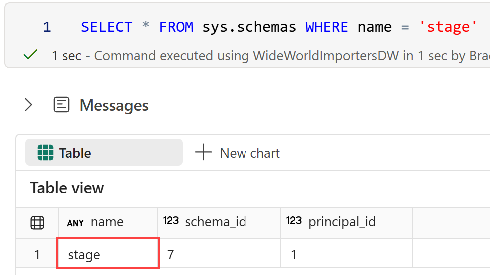
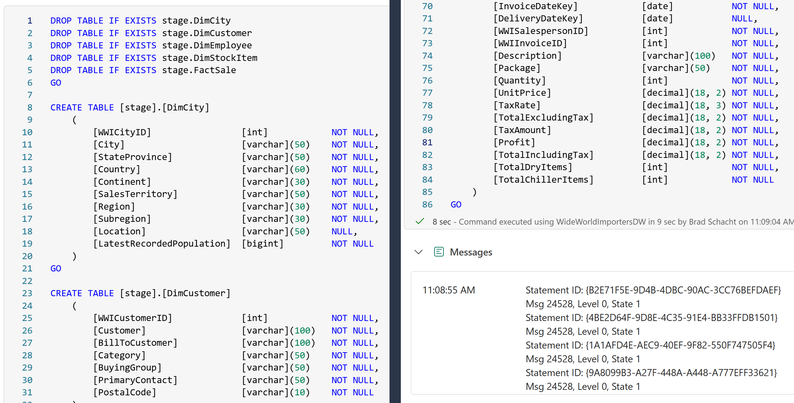
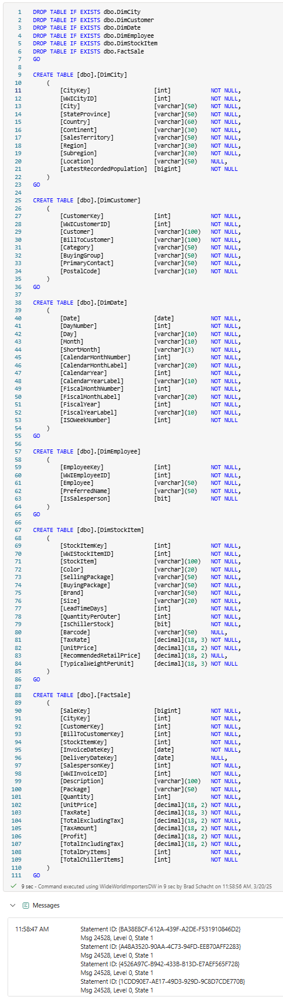

# End-to-End Data Engineering:<br>Modern Data Warehousing on Microsoft Fabric

## Lab 2 - Data warehouse basics
In this lab you will do something. 

### 2.1 - Notebooks, query editor, and client tools
1. Return to the Modern Data Warehousing on Microsoft Fabric workspace created in Lab 1.

1. From the <b>Import</b> menu, select <b>Notebook -> From this computer</b>.

    

1. From the **Import status** pane on the right side of the screen, select **Upload**.

1. Locate and select the **The Workshop.ipynb** file on your computer. Select **Open**.

1. The notebook will be uploaded and appear in the workspace.

### 2.2 - Schemas

1. In the workshop notebook, run the first cell in the **Labe 2 - Data warehouse basics** section which contains the query ```SELECT * FROM sys.schemas```. The results should look familiar for those used to working with SQL Server along with a new schema called *queryinsights* which will be used in Lab 7 - Data warehouse management.

    

1. Create a new schema called **stage** by running the next cell in the notebook.

    
    
1. Validate that the schema was created by running the next cell in the notebook.

    

### 2.3 - Tables

1. Create the stage tables, making sure to first drop any tables that may already exist, by running the first cell in the **2.3 - Tables** section of the workshop notebook.
    - stage.DimCity
    - stage.DimCustomer
    - stage.DimDate
    - stage.DimEmployee
    - stage.DimStockItem
    - stage.FactSale

    

1. Create the dimensional model tables, making sure to first drop any tables that may already exist, by running the next cell in the workshop notebook. 
    - dbo.DimCity
    - dbo.DimCustomer
    - dbo.DimDate
    - dbo.DimEmployee
    - dbo.DimStockItem
    - dbo.FactSale

    

1. Validate that the tables were all created by running the next cell in the notebook.

    


## Next steps
In this lab, we did something.

- Continue to lab the [Lab 3 - Loading data](<03 - Loading Data.md>) lab.

### Additional Resources
<li><a href="https://learn.microsoft.com/en-us/fabric/fundamentals/create-workspaces" targer="_blank">Create a workspace</a></li>
<li><a href="https://learn.microsoft.com/en-us/fabric/data-warehouse/create-warehouse" targer="_blank">Create a Warehouse in Microsoft Fabric</a></li>