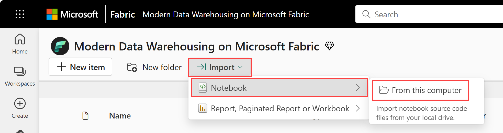
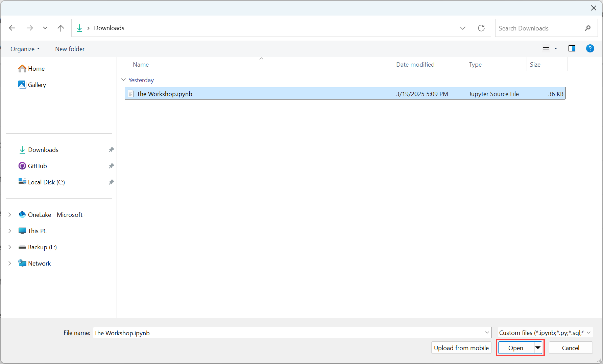

# End-to-End Data Engineering:<br>Modern Data Warehousing on Microsoft Fabric

## Lab 2 - Data warehouse basics
Before you being, make sure you check out the [prerequisites](00.md). If you have not completed [Lab 1 - Getting started](<00 - Getting started.md>), go complete all the steps then return here to continue.

This lab will cover:

<dl>
<dt><a href="#2.1">Notebooks, query editor, and client tools</a></dt>
<dt><a href="#2.2">Creating schemas</a></dt>
<dt><a href="#2.3">Creating tables</a></dt>
</dl>

<h3 id="2.1">2.1 - Notebooks, query editor, and client tools</h3>

1. Return to the *Modern Data Warehousing on Microsoft Fabric* workspace created in Lab 1 by selecting the workspace icon from the left navigation bar. 

    *Note: The icons on the navigation bar can be pinned and unpinned. Therefore, the icons you see may differ from the screenshot.*

    

1. From the <b>Import</b> menu located just below the workspace name, select <b>Notebook -> From this computer</b>.

    

1. From the **Import status** pane on the right side of the screen, select **Upload**.

    

1. Locate and select the **The Workshop.ipynb** file on your computer. Select **Open**.

    

1. The notebook will be uploaded and appear in the workspace.

    

<h3 id="2.2">2.2 - Creating schemas</h3>

Before beginning, open *The Workshop* notebook, navigate to **Lab 2 - Data warehouse basics**, and locate the **2.2 - Creating schemas** section.

1. Look to see what schemas already exist by running the cell for **Step 2.2.1** in *The Workshop* notebook. The results should look familiar for those used to working with SQL Server. Notice a schema called *queryinsights* which will be used in *Lab 7 - Data warehouse management*.

    ``` sql
    SELECT * FROM sys.schemas
    ```

    

1. Create a new schema called **stage** by running the cell for **Step 2.2.2** in *The Workshop* notebook. There will be no output after running this cell.

    ``` sql
    IF NOT EXISTS (SELECT * FROM sys.schemas WHERE name = 'stage')
    EXEC ('CREATE SCHEMA stage')
    ```
    
1. Validate that the schema was created by running the cell for **Step 2.2.3** in *The Workshop* notebook. Your schema_id may be different. This is not a problem, we only need to validate that the *stage* schema is in the result.

    ``` sql
    SELECT * FROM sys.schemas WHERE name = 'stage'
    ```

    

<h3 id="2.3">2.3 - Creating tables</h3>

Before beginning, open *The Workshop* notebook, navigate to **Lab 2 - Data warehouse basics**, and locate the **2.3 - Creating tables** section.

1. Create the stage tables, making sure to first drop any tables that may already exist, by running the cell for **Step 2.3.1** in *The Workshop* notebook. Upon completion, the cell will have a messages output but no query results.
    - stage.DimCity
    - stage.DimCustomer
    - stage.DimDate
    - stage.DimEmployee
    - stage.DimStockItem
    - stage.FactSale

    ``` sql
    DROP TABLE IF EXISTS stage.DimCity
    DROP TABLE IF EXISTS stage.DimCustomer
    DROP TABLE IF EXISTS stage.DimEmployee
    DROP TABLE IF EXISTS stage.DimStockItem
    DROP TABLE IF EXISTS stage.FactSale
    GO

    CREATE TABLE [stage].[DimCity]
        (
            [WWICityID]                 [int]            NOT NULL,
            [City]                      [varchar](50)    NOT NULL,
            [StateProvince]             [varchar](50)    NOT NULL,
            [Country]                   [varchar](60)    NOT NULL,
            [Continent]                 [varchar](30)    NOT NULL,
            [SalesTerritory]            [varchar](50)    NOT NULL,
            [Region]                    [varchar](30)    NOT NULL,
            [Subregion]                 [varchar](30)    NOT NULL,
            [Location]                  [varchar](50)    NULL,
            [LatestRecordedPopulation]  [bigint]         NOT NULL
        )
    GO

    CREATE TABLE [stage].[DimCustomer]
        (
            [WWICustomerID]             [int]            NOT NULL,
            [Customer]                  [varchar](100)   NOT NULL,
            [BillToCustomer]            [varchar](100)   NOT NULL,
            [Category]                  [varchar](50)    NOT NULL,
            [BuyingGroup]               [varchar](50)    NOT NULL,
            [PrimaryContact]            [varchar](50)    NOT NULL,
            [PostalCode]                [varchar](10)    NOT NULL
        )
    GO

    CREATE TABLE [stage].[DimEmployee]
        (
            [WWIEmployeeID]             [int]            NOT NULL,
            [Employee]                  [varchar](50)    NOT NULL,
            [PreferredName]             [varchar](50)    NOT NULL,
            [IsSalesperson]             [bit]            NOT NULL
        )
    GO

    CREATE TABLE [stage].[DimStockItem]
        (
            [WWIStockItemID]            [int]            NOT NULL,
            [StockItem]                 [varchar](100)   NOT NULL,
            [Color]                     [varchar](20)    NOT NULL,
            [SellingPackage]            [varchar](50)    NOT NULL,
            [BuyingPackage]             [varchar](50)    NOT NULL,
            [Brand]                     [varchar](50)    NOT NULL,
            [Size]                      [varchar](20)    NOT NULL,
            [LeadTimeDays]              [int]            NOT NULL,
            [QuantityPerOuter]          [int]            NOT NULL,
            [IsChillerStock]            [bit]            NOT NULL,
            [Barcode]                   [varchar](50)    NULL,
            [TaxRate]                   [decimal](18, 3) NOT NULL,
            [UnitPrice]                 [decimal](18, 2) NOT NULL,
            [RecommendedRetailPrice]    [decimal](18, 2) NULL,
            [TypicalWeightPerUnit]      [decimal](18, 3) NOT NULL
        )
    GO

    CREATE TABLE [stage].[FactSale]
        (
            [WWICityID]                 [int]            NOT NULL,
            [WWICustomerID]             [int]            NOT NULL,
            [WWIBillToCustomerID]       [int]            NOT NULL,
            [WWIStockItemID]            [int]            NOT NULL,
            [InvoiceDateKey]            [date]           NOT NULL,
            [DeliveryDateKey]           [date]           NULL,
            [WWISalespersonID]          [int]            NOT NULL,
            [WWIInvoiceID]              [int]            NOT NULL,
            [Description]               [varchar](100)   NOT NULL,
            [Package]                   [varchar](50)    NOT NULL,
            [Quantity]                  [int]            NOT NULL,
            [UnitPrice]                 [decimal](18, 2) NOT NULL,
            [TaxRate]                   [decimal](18, 3) NOT NULL,
            [TotalExcludingTax]         [decimal](18, 2) NOT NULL,
            [TaxAmount]                 [decimal](18, 2) NOT NULL,
            [Profit]                    [decimal](18, 2) NOT NULL,
            [TotalIncludingTax]         [decimal](18, 2) NOT NULL,
            [TotalDryItems]             [int]            NOT NULL,
            [TotalChillerItems]         [int]            NOT NULL
        )
    GO
    ```

1. Create the dimensional model tables, making sure to first drop any tables that may already exist, by running the cell for **Step 2.3.2** in *The Workshop* notebook. Upon completion, the cell will have a messages output but no query results.
    - dbo.DimCity
    - dbo.DimCustomer
    - dbo.DimDate
    - dbo.DimEmployee
    - dbo.DimStockItem
    - dbo.FactSale

    ``` sql
    DROP TABLE IF EXISTS dbo.DimCity
    DROP TABLE IF EXISTS dbo.DimCustomer
    DROP TABLE IF EXISTS dbo.DimDate
    DROP TABLE IF EXISTS dbo.DimEmployee
    DROP TABLE IF EXISTS dbo.DimStockItem
    DROP TABLE IF EXISTS dbo.FactSale
    GO

    CREATE TABLE [dbo].[DimCity]
        (
            [CityKey]                   [int]            NOT NULL,
            [WWICityID]                 [int]            NOT NULL,
            [City]                      [varchar](50)    NOT NULL,
            [StateProvince]             [varchar](50)    NOT NULL,
            [Country]                   [varchar](60)    NOT NULL,
            [Continent]                 [varchar](30)    NOT NULL,
            [SalesTerritory]            [varchar](50)    NOT NULL,
            [Region]                    [varchar](30)    NOT NULL,
            [Subregion]                 [varchar](30)    NOT NULL,
            [Location]                  [varchar](50)    NULL,
            [LatestRecordedPopulation]  [bigint]         NOT NULL
        )
    GO

    CREATE TABLE [dbo].[DimCustomer]
        (
            [CustomerKey]               [int]            NOT NULL,
            [WWICustomerID]             [int]            NOT NULL,
            [Customer]                  [varchar](100)   NOT NULL,
            [BillToCustomer]            [varchar](100)   NOT NULL,
            [Category]                  [varchar](50)    NOT NULL,
            [BuyingGroup]               [varchar](50)    NOT NULL,
            [PrimaryContact]            [varchar](50)    NOT NULL,
            [PostalCode]                [varchar](10)    NOT NULL
        )
    GO

    CREATE TABLE [dbo].[DimDate]
        (
            [Date]                      [date]           NOT NULL,
            [DayNumber]                 [int]            NOT NULL,
            [Day]                       [varchar](10)    NOT NULL,
            [Month]                     [varchar](10)    NOT NULL,
            [ShortMonth]                [varchar](3)     NOT NULL,
            [CalendarMonthNumber]       [int]            NOT NULL,
            [CalendarMonthLabel]        [varchar](20)    NOT NULL,
            [CalendarYear]              [int]            NOT NULL,
            [CalendarYearLabel]         [varchar](10)    NOT NULL,
            [FiscalMonthNumber]         [int]            NOT NULL,
            [FiscalMonthLabel]          [varchar](20)    NOT NULL,
            [FiscalYear]                [int]            NOT NULL,
            [FiscalYearLabel]           [varchar](10)    NOT NULL,
            [ISOWeekNumber]             [int]            NOT NULL
        )
    GO

    CREATE TABLE [dbo].[DimEmployee]
        (
            [EmployeeKey]               [int]            NOT NULL,
            [WWIEmployeeID]             [int]            NOT NULL,
            [Employee]                  [varchar](50)    NOT NULL,
            [PreferredName]             [varchar](50)    NOT NULL,
            [IsSalesperson]             [bit]            NOT NULL
        )
    GO

    CREATE TABLE [dbo].[DimStockItem]
        (
            [StockItemKey]              [int]            NOT NULL,
            [WWIStockItemID]            [int]            NOT NULL,
            [StockItem]                 [varchar](100)   NOT NULL,
            [Color]                     [varchar](20)    NOT NULL,
            [SellingPackage]            [varchar](50)    NOT NULL,
            [BuyingPackage]             [varchar](50)    NOT NULL,
            [Brand]                     [varchar](50)    NOT NULL,
            [Size]                      [varchar](20)    NOT NULL,
            [LeadTimeDays]              [int]            NOT NULL,
            [QuantityPerOuter]          [int]            NOT NULL,
            [IsChillerStock]            [bit]            NOT NULL,
            [Barcode]                   [varchar](50)    NULL,
            [TaxRate]                   [decimal](18, 3) NOT NULL,
            [UnitPrice]                 [decimal](18, 2) NOT NULL,
            [RecommendedRetailPrice]    [decimal](18, 2) NULL,
            [TypicalWeightPerUnit]      [decimal](18, 3) NOT NULL
        )
    GO

    CREATE TABLE [dbo].[FactSale]
        (
            [SaleKey]                   [bigint]         NOT NULL,
            [CityKey]                   [int]            NOT NULL,
            [CustomerKey]               [int]            NOT NULL,
            [BillToCustomerKey]         [int]            NOT NULL,
            [StockItemKey]              [int]            NOT NULL,
            [InvoiceDateKey]            [date]           NOT NULL,
            [DeliveryDateKey]           [date]           NULL,
            [SalespersonKey]            [int]            NOT NULL,
            [WWIInvoiceID]              [int]            NOT NULL,
            [Description]               [varchar](100)   NOT NULL,
            [Package]                   [varchar](50)    NOT NULL,
            [Quantity]                  [int]            NOT NULL,
            [UnitPrice]                 [decimal](18, 2) NOT NULL,
            [TaxRate]                   [decimal](18, 3) NOT NULL,
            [TotalExcludingTax]         [decimal](18, 2) NOT NULL,
            [TaxAmount]                 [decimal](18, 2) NOT NULL,
            [Profit]                    [decimal](18, 2) NOT NULL,
            [TotalIncludingTax]         [decimal](18, 2) NOT NULL,
            [TotalDryItems]             [int]            NOT NULL,
            [TotalChillerItems]         [int]            NOT NULL
        )
    GO
    ```

1. Validate that the tables were all created by running the cell for **Step 2.3.3** in *The Workshop* notebook and comparing to the output shown below.

    ``` sql
    SELECT
        SCHEMA_NAME(schema_id) AS SchemaName,
        name AS TableName
    FROM sys.tables
    WHERE
        SCHEMA_NAME(schema_id) IN ('dbo', 'stage')
    ORDER BY
        SchemaName,
        TableName
    ```

    


## Next steps
In this lab you created a new schema, stage (medallion bronze layer), to hold all the raw data before it is transformed into the dimensional model. You also created all the stage tables in the stage schema, and tables which will be used for the dimensional model (medaddion silver layer).

- Continue to [Lab 3 - Loading Data](<03 - Loading Data.md>)</a>

## Additional Resources
- <a href="https://learn.microsoft.com/en-us/fabric/data-warehouse/tables" target="_blank">Tables in data warehousing in Microsoft Fabric</a>
- <a href="https://learn.microsoft.com/en-us/fabric/data-warehouse/data-types" target="_blank">Data types in Microsoft Fabric</a>
- <a href="https://learn.microsoft.com/en-us/fabric/data-warehouse/table-constraints" target="_blank">Primary keys, foreign keys, and unique keys in Warehouse in Microsoft Fabric</a>
- <a href="https://learn.microsoft.com/en-us/fabric/data-warehouse/dimensional-modeling-dimension-tables" target="_blank">Dimensional modeling in Microsoft Fabric Warehouse: Dimension tables</a>
- <a href="https://learn.microsoft.com/en-us/fabric/data-warehouse/dimensional-modeling-fact-tables" target="_blank">Dimensional modeling in Microsoft Fabric Warehouse: Fact tables</a>