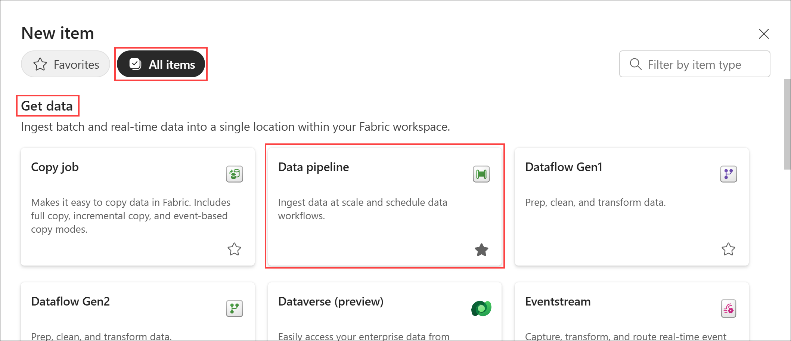
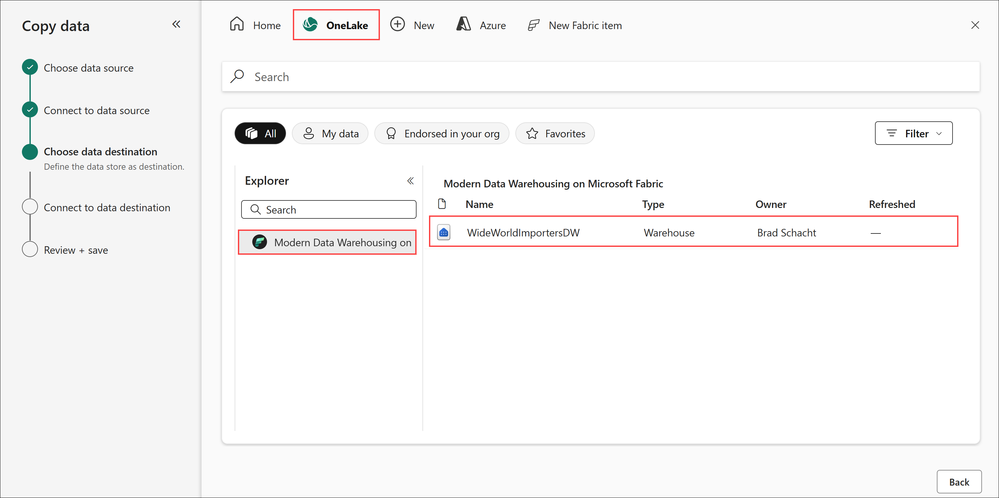
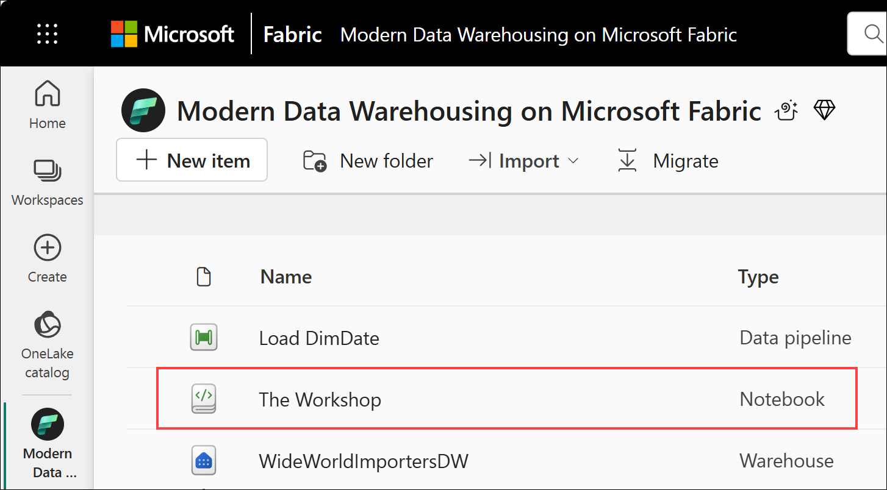

# End-to-End Data Engineering: Modern Data Warehousing on Microsoft Fabric

## Lab 3 - Loading data
Before you being:

- Make sure you check out the [prerequisites](00.md).
- If you have not completed [Lab 2 - Data warehouse basics](<01 - Data warehouse basics.md>), go complete all the steps then return here to continue.

This lab will cover:

- <a href="#3.1">Something</a>
- <a href="#3.2">Something</a>
- <a href="#3.3">Something</a>

<h3 id = "3.1"> 3.1 - Data Factory pipeline copy activity</h3>

1. Return to the *Modern Data Warehousing on Microsoft Fabric* workspace created in Lab 1 by selecting the **workspace icon** from the left navigation bar. 

    *Note: The icons on the navigation bar can be pinned and unpinned. Therefore, the icons you see may differ from the screenshot.*

    

1. Select **New item** located just below the workspace name.

    

1. From the **All items** view, locate the **Get data** section and select the **Data pipeline** tile.

    

1. On the **New pipeline** dialog box, enter the name **Load DimDate** and select **Create**. The pipeline will be created and open to a blank canvas with a set of links to get started quickly. 

    

1. Select the **Copy data assistant** tile.

    

1. On the **Choose data source** page, navigate to the **Sample data** tab and select **Retail Data Model from Wide World Importers**. The assistant will automatically move to the next page. 

    

1. On the **Connect to data source** page, select **dimension_date** from the list of available tables. A preview of the data in the table will load. Select **Next** in the bottom right corner.

    

1. On the **Choose data destination** page, navigate to the **OneLake** tab. Next, expand the **Explorer** and select your workspace from the list. The right pane will update to show a list of all the items in the workspace. Select the **WideWorldImportersDW** data warehouse from the list. The assistant will automatically move to the next page.

    

1. On the **Connect to data destination** page, perform the following actions:
    - Change the **Load settings** radio button to **Load to existing table**.
    - From the **Table** dropdown list, select the **dbo.DimDate** table.
    - Check to ensure the columns were all automatically mapped correctly. Adjust if necessary.
    - Select **Next**.

    

1. On the **Settings** page, accept the defaults by clicking **Next**.

    

1. On the **Review + save** page, uncheck the box for the **start data transfer immediately** option. Select **OK**. The assistant will close.

    

1. Select the newly created **copy data** activity on the canvas. It will have an automatically generated name that likely does *not* match the screenshot below. The bottom pane will change from the pipeline configuration options of *Parameters*, *Variables*, *Settings* and *Output* to the copy data activity options of *General*, *Source*, *Destination*, *Mapping*, and *Settings*.

    

1. On the **General** page, enter **CD Load DimDate** for the the **Name** of the activity. 

    

1. Navigate to the **Destination** page. Expand the **Advanced** settings. In the **Pre-copy script** enter **TRUNCATE TABLE dbo.DimDate**. This will ensure if the pipeline is run multiple times it does not result in duplicate data landing in the table.

    

1. From the **Home** tab of the ribbon, select **Run**.

    

1. On the **Save and run** dialog box, select **Save and run**. 

    

1. A few seconds later a notification will appear indicating the pipeline has started running. The bottom pane will automatically switch to the **Output** page where you can monitor the pipeline's progress.

    

    

1. On the **Output** page, when the **Activity stats** changes to **Succeeded**, select **CD Load DimDate** in the **Activity name** column.

    

1. On the **Copy data details** pane, make note of the number of records that were written for later reference: **6,210 rows written**. Select **Close**.

    

<h3 id = "3.2">3.2 - T-SQL INSERT INTO...SELECT FROM</h3>

1. Return to the *Modern Data Warehousing on Microsoft Fabric* workspace created in Lab 1 by selecting the **workspace icon** from the left navigation bar. 

    *Note: The icons on the navigation bar can be pinned and unpinned. Therefore, the icons you see may differ from the screenshot.*

    

1. From the item list, select **The Workshop** notebook.

    

1. Truncate then load the stage table for FactSale from the lakehouse using a cross database query by running the first cell in the **3.2 - T-SQL INSERT INTO...SELECT FROM** section of The Workshop notebook.

    

1. Upon completion, expand the **Messages** from the notebook cell's output to check the number of rows loaded. *Your row count will be different from the one picured below.*

    

1. Run the next cell and validate the row count on the table matches the number of rows affeced from the message in the prior step.

    

<h3 id = "3.3">3.3 - T-SQL COPY INTO</h3>

1. Truncate then load the stage tables listed below from Azure storage using the COPY INTO command by running the first cell in the **3.3 - T-SQL COPY INTO** section of The Workshop notebook.

    - stage.DimCity
    - stage.DimCustomer
    - stage.DimEmployee
    - stage.DimStockItem
    - stage.FactSale

    

1. Upon completion, run the next notebook cell to validate the number of rows loaded into all the stage tables. *Your row counts should match the screenshot below.*

    

## Next steps
In this lab, we did something.

- Continue to lab the [Lab 4 - Data transformation using T-SQL](<04 - Data transformation using T-SQL.md>) lab.

## Additional Resources
<li><a href="https://learn.microsoft.com/en-us/fabric/fundamentals/create-workspaces" targer="_blank">Create a workspace</a></li>
<li><a href="https://learn.microsoft.com/en-us/fabric/data-warehouse/create-warehouse" targer="_blank">Create a Warehouse in Microsoft Fabric</a></li>