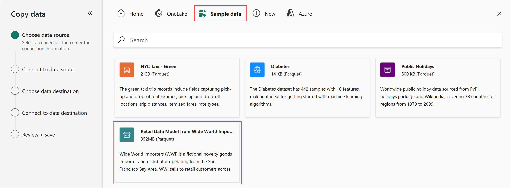
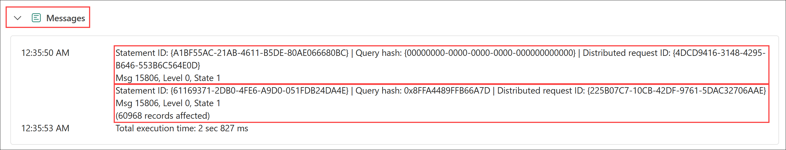
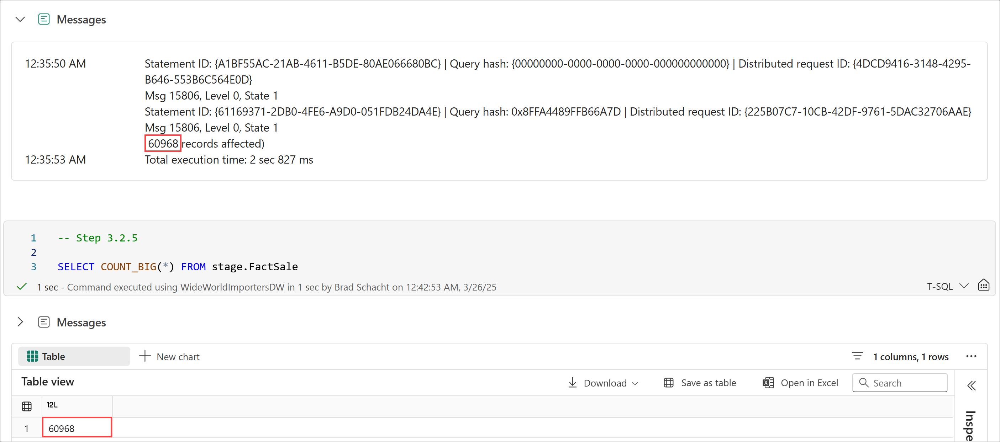
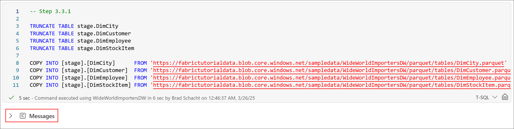
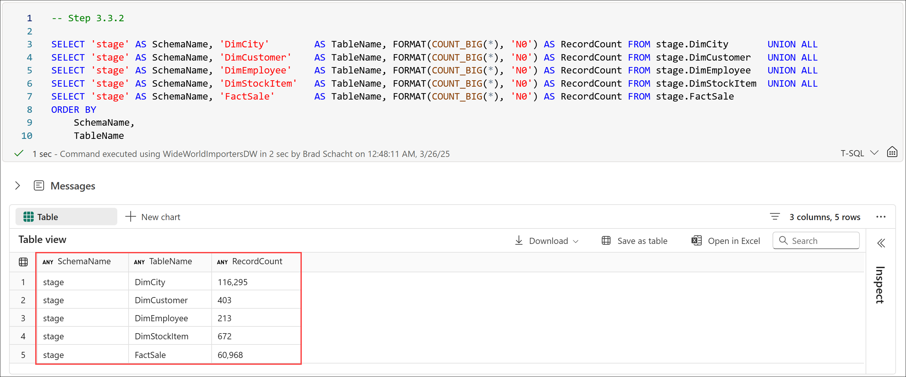

# End-to-End Data Engineering:<br>Modern Data Warehousing on Microsoft Fabric

## Lab 3 - Loading data
Before you being:

- Make sure you check out the [prerequisites](00.md).
- If you have not completed [Lab 2 - Data warehouse DDL](<02 - Data warehouse DDL.md>), go complete all the steps then return here to continue.

This lab will cover:

- <a href="#3.1">Data Factory pipeline copy activity</a>
- <a href="#3.2">T-SQL INSERT INTO...SELECT FROM</a>
- <a href="#3.3">T-SQL COPY INTO</a>

<hr>

<h3 id = "3.1"> 3.1 - Data Factory pipeline copy activity</h3>

1. Return to the *Modern Data Warehousing on Microsoft Fabric* workspace created in Lab 0 by selecting the **workspace icon** from the left navigation bar. 

    *Note: The icons on the navigation bar can be pinned and unpinned. Therefore, the icons you see may differ from the screenshot.*

    

1. Select **New item** located just below the workspace name.

    

1. From the **All items** view, locate the **Get data** section and select the **Data pipeline** tile.

    

1. On the **New pipeline** dialog box, enter the name **Load DimDate** and select **Create**. The pipeline will be created and open to a blank canvas with a set of links to get started quickly. 

    

1. Select the **Copy data assistant** tile.

    

1. On the **Choose data source** page, navigate to the **Sample data** tab and select **Retail Data Model from Wide World Importers**. The assistant will automatically move to the next page. 

    

1. On the **Connect to data source** page, select **dimension_date** from the list of available tables. A preview of the data in the table will load. Select **Next** in the bottom right corner.

    

1. On the **Choose data destination** page, navigate to the **OneLake** tab. Next, expand the **Explorer** and select your workspace from the list. The right pane will update to show a list of all the items in the workspace. Select the **WideWorldImportersDW** data warehouse from the list. The assistant will automatically move to the next page.

    

1. On the **Connect to data destination** page, perform the following actions:
    - Change the **Load settings** radio button to **Load to existing table**.
    - From the **Table** dropdown list, select the **dbo.DimDate** table.
    - Check to ensure the columns were all automatically mapped correctly. Adjust if necessary.
    - Select **Next**.

    

1. On the **Settings** page, accept the defaults by clicking **Next**.

    

1. On the **Review + save** page, uncheck the box for the **start data transfer immediately** option. Select **OK**. The assistant will close.

    

1. Select the newly created **copy data** activity on the canvas. It will have an automatically generated name that likely does *not* match the screenshot below. The bottom pane will change from the pipeline configuration options of *Parameters*, *Variables*, *Settings* and *Output* to the copy data activity options of *General*, *Source*, *Destination*, *Mapping*, and *Settings*.

    

1. On the **General** page, enter **CD Load DimDate** for the the **Name** of the activity. 

    

1. Navigate to the **Destination** page. Expand the **Advanced** settings. In the **Pre-copy script** enter **TRUNCATE TABLE dbo.DimDate**. This will ensure if the pipeline is run multiple times it does not result in duplicate data landing in the table.

    

1. From the **Home** tab of the ribbon, select **Run**.

    

1. On the **Save and run** dialog box, select **Save and run**. 

    

1. A few seconds later a notification will appear indicating the pipeline has started running. The bottom pane will automatically switch to the **Output** page where you can monitor the pipeline's progress.

    

    

1. On the **Output** page, when the **Activity stats** changes to **Succeeded**, select **CD Load DimDate** in the **Activity name** column.

    

1. On the **Copy data details** pane, make note of the number of records that were written for later reference: **6,210 rows written**. Select **Close**.

    

<h3 id = "3.2">3.2 - T-SQL INSERT INTO...SELECT FROM</h3>

1. Return to the *Modern Data Warehousing on Microsoft Fabric* workspace created in Lab 1 by selecting the **workspace icon** from the left navigation bar. 

    *Note: The icons on the navigation bar can be pinned and unpinned. Therefore, the icons you see may differ from the screenshot.*

    

1. From the item list, select **The Workshop** notebook and navigate to **Lab 3 - Loading data**, and locate the **3.2 - T-SQL INSERT INTO...SELECT FROM** section.

    

1. Truncate then load the stage table for FactSale from the lakehouse using a cross database query by running the cell for **Step 3.2.3** in *The Workshop* notebook. 

    *Note: This step loads the stage.FactSale table. In the first step of the next section you will be instructed to TRUNCATE and LOAD this same table. This is not an error. The goal of this section is to introduce the INSERT INTO...SELECT FROM loading pattern which will be used for incremental loads in Lab 5 - Orchestrating warehouse operations.*

    ``` sql
    TRUNCATE TABLE stage.FactSale

    INSERT INTO stage.FactSale
    SELECT
        [WWICityID]
        ,[WWICustomerID]
        ,[WWIBillToCustomerID]
        ,[WWIStockItemID]
        ,[InvoiceDateKey]
        ,[DeliveryDateKey]
        ,[WWISalespersonID]
        ,[WWIInvoiceID]
        ,[Description]
        ,[Package]
        ,[Quantity]
        ,[UnitPrice]
        ,[TaxRate]
        ,[TotalExcludingTax]
        ,[TaxAmount]
        ,[Profit]
        ,[TotalIncludingTax]
        ,[TotalDryItems]
        ,[TotalChillerItems]
    FROM WideWorldImporters.dbo.Sale
    ```

1. Upon completion, the cell will have a messages output but no query results. Expand the **Messages** from the notebook cell's output. You can verify that two statements were run by the presence of two statement ids. The second message includes the number of records loaded into the table.

    *Note: Your record counts will be different than the record counts shown in the screenshot below.*

    

1. Validate the row count on the table matches the number of rows affeced from the message in the prior step by running the cell for **Step 3.2.5** in *The Workshop* notebook.

    ``` sql
    SELECT COUNT_BIG(*) FROM stage.FactSale
    ```

    

<h3 id = "3.3">3.3 - T-SQL COPY INTO</h3>

Before beginning, open *The Workshop* notebook, navigate to **Lab 3 - Data loading**, and locate the **3.3 - T-SQL COPY INTO** section.

1. Truncate then load the stage tables listed below from Azure storage using the *COPY INTO* command by running the cell for **Step 3.3.1** in *The Workshop* notebook. Upon completion, the cell will have a messages output but no query results.

    *Note: This step loads the stage.FactSale table. In the prior section this table was loaded using a different method. This is not an error. The prior section was to introduce a specific loading pattern which will be used again in a later lab. The purpose of this section's code it to see the initial dataset which is not present in the WideWorldImporters.dbo.Sale table used in the prior section.*

    - stage.DimCity
    - stage.DimCustomer
    - stage.DimEmployee
    - stage.DimStockItem
    - stage.FactSale

    ``` sql
    TRUNCATE TABLE stage.DimCity
    TRUNCATE TABLE stage.DimCustomer
    TRUNCATE TABLE stage.DimEmployee
    TRUNCATE TABLE stage.DimStockItem
    TRUNCATE TABLE stage.FactSale

    COPY INTO [stage].[DimCity]      FROM 'https://scbradlstorage01.dfs.core.windows.net/sampledata/WWI/DimCity.parquet'      WITH (FILE_TYPE = 'PARQUET');
    COPY INTO [stage].[DimCustomer]  FROM 'https://scbradlstorage01.dfs.core.windows.net/sampledata/WWI/DimCustomer.parquet'  WITH (FILE_TYPE = 'PARQUET');
    COPY INTO [stage].[DimEmployee]  FROM 'https://scbradlstorage01.dfs.core.windows.net/sampledata/WWI/DimEmployee.parquet'  WITH (FILE_TYPE = 'PARQUET');
    COPY INTO [stage].[DimStockItem] FROM 'https://scbradlstorage01.dfs.core.windows.net/sampledata/WWI/DimStockItem.parquet' WITH (FILE_TYPE = 'PARQUET');
    /* The storage account location for FactSale only contains 2013-2016 data */
    COPY INTO [stage].[FactSale]     FROM 'https://scbradlstorage01.dfs.core.windows.net/sampledata/WWI/FactSale.parquet'     WITH (FILE_TYPE = 'PARQUET');
    ```

    

1. Upon completion, validate the number of rows loaded into all the stage tables by running the cell for **Step 3.3.2** in *The Workshop* notebook.

    *Note: Your row counts **should** match the counts below.*

    ``` sql
    SELECT 'stage' AS SchemaName, 'DimCity'        AS TableName, FORMAT(COUNT_BIG(*), 'N0') AS RecordCount FROM stage.DimCity       UNION ALL
    SELECT 'stage' AS SchemaName, 'DimCustomer'    AS TableName, FORMAT(COUNT_BIG(*), 'N0') AS RecordCount FROM stage.DimCustomer   UNION ALL
    SELECT 'stage' AS SchemaName, 'DimEmployee'    AS TableName, FORMAT(COUNT_BIG(*), 'N0') AS RecordCount FROM stage.DimEmployee   UNION ALL
    SELECT 'stage' AS SchemaName, 'DimStockItem'   AS TableName, FORMAT(COUNT_BIG(*), 'N0') AS RecordCount FROM stage.DimStockItem  UNION ALL
    SELECT 'stage' AS SchemaName, 'FactSale'       AS TableName, FORMAT(COUNT_BIG(*), 'N0') AS RecordCount FROM stage.FactSale
    ORDER BY
        SchemaName,
        TableName
    ```

    

    <table style="tr:nth-child(even) {background-color: #f2f2f2;}; text-align: left; display: table; border-collapse: collapse; border-spacing: 2px; border-color: gray;">
    <tr><th style="background-color: #1b20a1; color: white;">Table</th> <th style="background-color: #1b20a1; color: white;">Record Count</th></tr>
    <tr><td>stage.DimCity</td>      <td>37,941</td></tr>
    <tr><td>stage.DimCustomer</td>  <td>403</td></tr>
    <tr><td>stage.DimEmployee</td>  <td>20</td></tr>
    <tr><td>stage.DimStockItem</td> <td>228</td></tr>
    <tr><td>stage.FactSale</td>     <td>228,265</td></tr>
    </table>

## Next steps
In this lab you loaded data using a copy activity in a pipeline, the T-SQL INSERT INTO command to pull data from a lakehouse table, and the T-SQL COPY INTO command to load data from Azure storage. These are not the only methods for loading a data warehouse but they encompass the most commonly used methods. 

- Continue to [Lab 4 - Data transformation using T-SQL](<04 - Data transformation using T-SQL.md>)
- Return to the [workshop homepage](<../README.md>)

## Additional Resources
- [Ingest data into the Warehouse](https://learn.microsoft.com/en-us/fabric/data-warehouse/ingest-data)
- [Ingest data into your Warehouse using the COPY statement](https://learn.microsoft.com/en-us/fabric/data-warehouse/ingest-data-copy)
- [COPY INTO](https://learn.microsoft.com/en-us/sql/t-sql/statements/copy-into-transact-sql?view=fabric&preserve-view=true)
- [Ingest data into existing tables with T-SQL queries](https://learn.microsoft.com/en-us/fabric/data-warehouse/ingest-data-tsql#ingesting-data-into-existing-tables-with-t-sql-queries)
- [Ingest data into your Warehouse using data pipelines](https://learn.microsoft.com/en-us/fabric/data-warehouse/ingest-data-pipelines)
- [Browse file content using OPENROWSET function](https://learn.microsoft.com/en-us/fabric/data-warehouse/browse-file-content-with-openrowset)