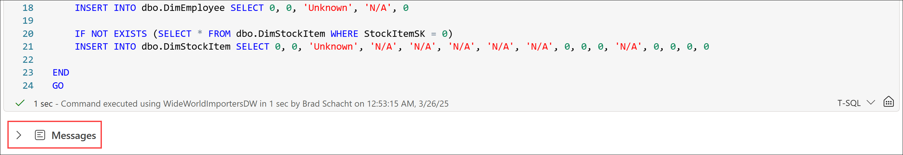
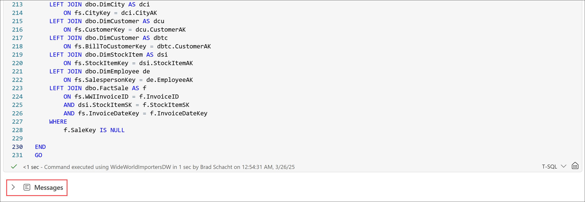
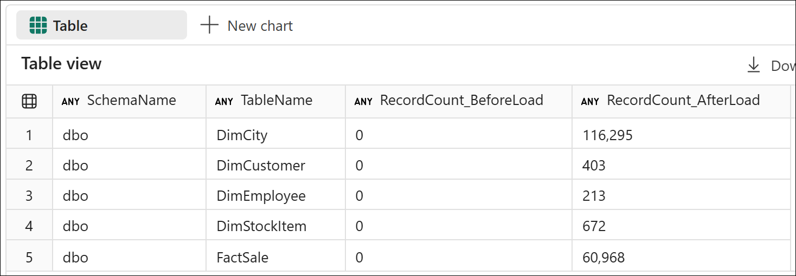

# End-to-End Data Engineering:<br>Modern Data Warehousing on Microsoft Fabric

## Lab 4 - Data transformation using T-SQL
Before you being:

- Make sure you check out the [prerequisites](00.md).
- If you have not completed [Lab 3 - Load data](<03 - Loading Data.md>), go complete all the steps then return here to continue.

This lab will cover:

- <a href="#4.1">Stored procedures</a>
- <a href="#4.2">Incrementally updating tables</a>

<hr>

<h3 id = "4.1">4.1 - Stored procedures</h3>

*Note: If you just completed Lab 3 and still have The Workshop notebook open, remain in The Workshop notebook, navigate to **Lab 4 - Data transformation using T-SQL**, and locate the **4.1 - Stored procedures** section, and move straight to step 3 below.*

1. Return to the *Modern Data Warehousing on Microsoft Fabric* workspace created in Lab 0 by selecting the **workspace icon** from the left navigation bar. 

    *Note: The icons on the navigation bar can be pinned and unpinned. Therefore, the icons you see may differ from the screenshot.*

    

1. From the item list, select **The Workshop** notebook and navigate to **Lab 4 - Data transformation using T-SQL**, and locate the **4.1 - Stored procedures** section.

    

1. Create the stored procedure to generate the unknown member for each dimension table if it does not exist by running the cell for **Step 4.1.3** in *The Workshop* notebook. Upcon completion, the cell will have a message output but no query results.

    ``` sql
    -- dbo.CreateUnknownMember stored procedure
    DROP PROCEDURE IF EXISTS dbo.CreateUnknownMembers
    GO


    CREATE PROCEDURE dbo.CreateUnknownMembers
    AS
    BEGIN

        IF NOT EXISTS (SELECT * FROM dbo.DimCity WHERE CityKey = 0)
        INSERT INTO dbo.DimCity SELECT 0, 0, 'Unknown', 'N/A', 'N/A', 'N/A', 'N/A', 'N/A', 'N/A', NULL, 0

        IF NOT EXISTS (SELECT * FROM dbo.DimCustomer WHERE CustomerKey = 0)
        INSERT INTO dbo.DimCustomer SELECT 0, 0, 'Unknown', 'N/A', 'N/A', 'N/A', 'N/A', 'N/A'

        IF NOT EXISTS (SELECT * FROM dbo.DimEmployee WHERE EmployeeKey = 0)
        INSERT INTO dbo.DimEmployee SELECT 0, 0, 'Unknown', 'N/A', 0

        IF NOT EXISTS (SELECT * FROM dbo.DimStockItem WHERE StockItemKey = 0)
        INSERT INTO dbo.DimStockItem SELECT 0, 0, 'Unknown', 'N/A', 'N/A', 'N/A', 'N/A', 'N/A', 0, 0, 0, 'N/A', 0, 0, 0, 0

    END
    GO   
    ```

    

1. Create the stored procedures to perform an UPSERT or MERGE operation on the dimensional model tables by running the cell for **Step 4.1.4** in *The Workshop* notebook. Upon completion, the cell will have a messages output but no query results.

    ``` sql
    -- dbo.UpdateDimCity stored procedure
    DROP PROCEDURE IF EXISTS dbo.UpdateDimCity
    GO


    CREATE PROCEDURE dbo.UpdateDimCity
    AS
    BEGIN

        UPDATE destination
        SET
            destination.[WWICityID] 				= source.[WWICityID],
            destination.[City] 						= source.[City],
            destination.[StateProvince] 			= source.[StateProvince],
            destination.[Country] 					= source.[Country],
            destination.[Continent] 				= source.[Continent],
            destination.[SalesTerritory] 			= source.[SalesTerritory],
            destination.[Region] 					= source.[Region],
            destination.[Subregion] 				= source.[Subregion],
            destination.[Location] 					= source.[Location],
            destination.[LatestRecordedPopulation] 	= source.[LatestRecordedPopulation]
        FROM dbo.DimCity AS destination
        INNER JOIN stage.DimCity AS source
            ON destination.[WWICityID] = source.[WWICityID]

        DECLARE @MaxID BIGINT = (SELECT ISNULL(MAX(CityKey), 0) FROM dbo.DimCity)

        INSERT INTO dbo.DimCity
        SELECT
            @MaxID + ROW_NUMBER() OVER(ORDER BY (SELECT NULL)) AS [CityKey],
            [WWICityID],
            [City],
            [StateProvince],
            [Country],
            [Continent],
            [SalesTerritory],
            [Region],
            [Subregion],
            [Location],
            [LatestRecordedPopulation]
        FROM stage.DimCity
        WHERE WWICityID NOT IN (SELECT WWICityID FROM dbo.DimCity)

    END
    GO


    -- dbo.UpdateDimCustomer stored procedure
    DROP PROCEDURE IF EXISTS dbo.UpdateDimCustomer
    GO

    CREATE PROCEDURE dbo.UpdateDimCustomer
    AS
    BEGIN

        UPDATE destination
        SET
            destination.[WWICustomerID] 	= source.[WWICustomerID],
            destination.[Customer] 			= source.[Customer],
            destination.[BillToCustomer] 	= source.[BillToCustomer],
            destination.[Category] 			= source.[Category],
            destination.[BuyingGroup] 		= source.[BuyingGroup],
            destination.[PrimaryContact] 	= source.[PrimaryContact],
            destination.[PostalCode] 		= source.[PostalCode]
        FROM dbo.DimCustomer AS destination
        INNER JOIN stage.DimCustomer AS source
            ON destination.[WWICustomerID] = source.[WWICustomerID]

        DECLARE @MaxID BIGINT = (SELECT ISNULL(MAX(CustomerKey), 0) FROM dbo.DimCustomer)

        INSERT INTO dbo.DimCustomer
        SELECT
            @MaxID + ROW_NUMBER() OVER(ORDER BY (SELECT NULL)) AS [CustomerKey],
            [WWICustomerID],
            [Customer],
            [BillToCustomer],
            [Category],
            [BuyingGroup],
            [PrimaryContact],
            [PostalCode]		
        FROM stage.DimCustomer
        WHERE WWICustomerID NOT IN (SELECT WWICustomerID FROM dbo.DimCustomer)

    END
    GO


    -- dbo.UpdateDimEmployee stored procedure
    DROP PROCEDURE IF EXISTS dbo.UpdateDimEmployee
    GO

    CREATE PROCEDURE dbo.UpdateDimEmployee
    AS
    BEGIN

        UPDATE destination
        SET
            destination.[WWIEmployeeID] 	= source.[WWIEmployeeID],
            destination.[Employee] 			= source.[Employee],
            destination.[PreferredName] 	= source.[PreferredName],
            destination.[IsSalesperson]		= source.[IsSalesperson]
        FROM dbo.DimEmployee AS destination
        INNER JOIN stage.DimEmployee AS source
            ON destination.[WWIEmployeeID] = source.[WWIEmployeeID]

        DECLARE @MaxID BIGINT = (SELECT ISNULL(MAX(EmployeeKey), 0) FROM dbo.DimEmployee)

        INSERT INTO dbo.DimEmployee
        SELECT
            @MaxID + ROW_NUMBER() OVER(ORDER BY (SELECT NULL)) AS [EmployeeKey],
            [WWIEmployeeID],
            [Employee],
            [PreferredName],
            [IsSalesperson]		
        FROM stage.DimEmployee
        WHERE WWIEmployeeID NOT IN (SELECT WWIEmployeeID FROM dbo.DimEmployee)

    END
    GO


    -- dbo.UpdateDimStockItem stored procedure
    DROP PROCEDURE IF EXISTS dbo.UpdateDimStockItem
    GO

    CREATE PROCEDURE dbo.UpdateDimStockItem
    AS
    BEGIN

        UPDATE destination
        SET
            destination.[WWIStockItemID] 			= source.[WWIStockItemID],
            destination.[StockItem] 				= source.[StockItem],
            destination.[Color] 					= source.[Color],
            destination.[SellingPackage] 			= source.[SellingPackage],
            destination.[BuyingPackage] 			= source.[BuyingPackage],
            destination.[Brand] 					= source.[Brand],
            destination.[Size] 						= source.[Size],
            destination.[LeadTimeDays] 				= source.[LeadTimeDays],
            destination.[QuantityPerOuter] 			= source.[QuantityPerOuter],
            destination.[IsChillerStock] 			= source.[IsChillerStock],
            destination.[Barcode] 					= source.[Barcode],
            destination.[TaxRate] 					= source.[TaxRate],
            destination.[UnitPrice] 				= source.[UnitPrice],
            destination.[RecommendedRetailPrice] 	= source.[RecommendedRetailPrice],
            destination.[TypicalWeightPerUnit] 		= source.[TypicalWeightPerUnit]
        FROM dbo.DimStockItem AS destination
        INNER JOIN stage.DimStockItem AS source
            ON destination.[WWIStockItemID] = source.[WWIStockItemID]

        DECLARE @MaxID BIGINT = (SELECT ISNULL(MAX(StockItemKey), 0) FROM dbo.DimStockItem)

        INSERT INTO dbo.DimStockItem
        SELECT
            @MaxID + ROW_NUMBER() OVER(ORDER BY (SELECT NULL)) AS [StockItemKey],
            [WWIStockItemID],
            [StockItem],
            [Color],
            [SellingPackage],
            [BuyingPackage],
            [Brand],
            [Size],
            [LeadTimeDays],
            [QuantityPerOuter],
            [IsChillerStock],
            [Barcode],
            [TaxRate],
            [UnitPrice],
            [RecommendedRetailPrice],
            [TypicalWeightPerUnit]
        FROM stage.DimStockItem
        WHERE WWIStockItemID NOT IN (SELECT WWIStockItemID FROM dbo.DimStockItem)

    END
    GO


    -- dbo.UpdateFactSale stored procedure
    DROP PROCEDURE IF EXISTS dbo.UpdateFactSale
    GO

    CREATE PROCEDURE dbo.UpdateFactSale
    AS
    BEGIN

        DECLARE @MaxID BIGINT = (SELECT ISNULL(MAX(SaleKey), 0) FROM dbo.FactSale)

        INSERT INTO dbo.FactSale
        SELECT
            @MaxID + ROW_NUMBER() OVER(ORDER BY (SELECT NULL)) AS [SaleKey],
            ISNULL(dci.CityKey, 0) AS CityKey,
            ISNULL(dcu.CustomerKey, 0) AS CustomerKey,
            ISNULL(dbtc.CustomerKey, 0) AS BillToCustomerKey,
            ISNULL(dsi.StockItemKey, 0) AS StockItemKey,
            fs.InvoiceDateKey,
            fs.DeliveryDateKey,
            ISNULL(de.EmployeeKey, 0) AS SalespersonKey,
            fs.WWIInvoiceID,
            fs.[Description],
            fs.Package,
            fs.Quantity,
            fs.UnitPrice,
            fs.TaxRate,
            fs.TotalExcludingTax,
            fs.TaxAmount,
            fs.Profit,
            fs.TotalIncludingTax,
            fs.TotalDryItems,
            fs.TotalChillerItems
        FROM stage.FactSale AS fs
        LEFT JOIN dbo.DimCity AS dci
            ON fs.WWICityID = dci.WWICityID
        LEFT JOIN dbo.DimCustomer AS dcu
            ON fs.WWICustomerID = dcu.WWICustomerID
        LEFT JOIN dbo.DimCustomer AS dbtc
            ON fs.WWIBillToCustomerID = dbtc.WWICustomerID
        LEFT JOIN dbo.DimStockItem AS dsi
            ON fs.WWIStockItemID = dsi.WWIStockItemID
        LEFT JOIN dbo.DimEmployee de
            ON fs.WWISalespersonID = de.WWIEmployeeID
        LEFT JOIN dbo.FactSale AS f
            ON fs.WWIInvoiceID = f.WWIInvoiceID
            AND dsi.StockItemKey = f.StockItemKey
            AND fs.InvoiceDateKey = f.InvoiceDateKey
        WHERE
            f.SaleKey IS NULL
            
    END
    GO
    ```

    

1. In the **Explorer**, refresh the warehouse object list by selecting the ellipsis (**...**) that appears when hovering the mouse of the warehouse name *WideWorldImportersDW*, then select **Refresh**.

    

1. In the **Explorer**, expand **WideWorldImportersDW -> Schemas -> dbo -> Stored Procedures** to validate that all the procedures were created successfully.

    - CreateUnknownMembers
    - UpdateDimCity
    - UpdateDimCustomer
    - UpdateDimEmployee
    - UpdateDimStockItem
    - UpdateFactSale

    

<h3 id = "4.2">4.2 - Incrementally updating tables</h3>

Before beginning, open *The Workshop* notebook, navigate to **Lab 4 - Data transformation using T-SQL**, and locate the **4.2 - Incrementally updating tables** section.

1. Execute all the stored procedures created in the previous section by running the cell for **Step 4.2.1** in *The Workshop* notebook. 

    *Note: More detail about what this code does and exploration of the results are provided in the next step.*

    ``` sql
    DECLARE @CountBeforeLoadDimCity      BIGINT = (SELECT COUNT_BIG(*) FROM dbo.DimCity)
    DECLARE @CountBeforeLoadDimCustomer  BIGINT = (SELECT COUNT_BIG(*) FROM dbo.DimCustomer)
    DECLARE @CountBeforeLoadDimEmployee  BIGINT = (SELECT COUNT_BIG(*) FROM dbo.DimEmployee)
    DECLARE @CountBeforeLoadDimStockItem BIGINT = (SELECT COUNT_BIG(*) FROM dbo.DimStockItem)
    DECLARE @CountBeforeLoadFactSale     BIGINT = (SELECT COUNT_BIG(*) FROM dbo.FactSale)

    EXEC dbo.CreateUnknownMembers;
    EXEC dbo.UpdateDimCity;
    EXEC dbo.UpdateDimCustomer;
    EXEC dbo.UpdateDimEmployee;
    EXEC dbo.UpdateDimStockItem;
    EXEC dbo.UpdateFactSale;

    SELECT 'dbo'   AS SchemaName, 'DimCity'        AS TableName, FORMAT(@CountBeforeLoadDimCity,      'N0') AS RecordCount_BeforeLoad, FORMAT(COUNT_BIG(*), 'N0') AS RecordCount_AfterLoad FROM dbo.DimCity         UNION ALL
    SELECT 'dbo'   AS SchemaName, 'DimCustomer'    AS TableName, FORMAT(@CountBeforeLoadDimCustomer,  'N0') AS RecordCount_BeforeLoad, FORMAT(COUNT_BIG(*), 'N0') AS RecordCount_AfterLoad FROM dbo.DimCustomer     UNION ALL
    SELECT 'dbo'   AS SchemaName, 'DimEmployee'    AS TableName, FORMAT(@CountBeforeLoadDimEmployee,  'N0') AS RecordCount_BeforeLoad, FORMAT(COUNT_BIG(*), 'N0') AS RecordCount_AfterLoad FROM dbo.DimEmployee     UNION ALL
    SELECT 'dbo'   AS SchemaName, 'DimStockItem'   AS TableName, FORMAT(@CountBeforeLoadDimStockItem, 'N0') AS RecordCount_BeforeLoad, FORMAT(COUNT_BIG(*), 'N0') AS RecordCount_AfterLoad FROM dbo.DimStockItem    UNION ALL
    SELECT 'dbo'   AS SchemaName, 'FactSale'       AS TableName, FORMAT(@CountBeforeLoadFactSale,     'N0') AS RecordCount_BeforeLoad, FORMAT(COUNT_BIG(*), 'N0') AS RecordCount_AfterLoad FROM dbo.FactSale
    ORDER BY
        SchemaName,
        TableName
    ```

1. Upon completion, compare the results with those in the screenshot and table below. The code in the executed cell performed several steps:

    1. Store the record count for each of the dimensional model tables before any data is transformed from stage -> dimensional model.
    1. Run all the five stored procedures to load the dimensional model tables (one procedure per table).
    1. Display the record count from before the data load and after the data load to ensure data was properly loaded.

    The *RecordCount_AfterLoad* numbers should match those of the stage table record counts produced after running the COPY INTO commands at the end of *Lab 3 - Loading data* indicating all the data was loaded from stage into the dimensional model.

    

    <table style="tr:nth-child(even) {background-color: #f2f2f2;}; text-align: left; display: table; border-collapse: collapse; border-spacing: 2px; border-color: gray;">
    <tr><th style="background-color: #1b20a1; color: white;">SchemaName</th> <th style="background-color: #1b20a1; color: white;">TableName</th> <th style="background-color: #1b20a1; color: white;">RecordCount_BeforeLoad</th> <th style="background-color: #1b20a1; color: white;">RecordCount_AfterLoad</th></tr>
    <tr><td>dbo</td><td>DimCity</td>      <td>0</td><td>37,941</td></tr>
    <tr><td>dbo</td><td>DimCustomer</td>  <td>0</td><td>403</td></tr>
    <tr><td>dbo</td><td>DimEmployee</td>  <td>0</td><td>20</td></tr>
    <tr><td>dbo</td><td>DimStockItem</td> <td>0</td><td>228</td></tr>
    <tr><td>dbo</td><td>FactSale</td>     <td>0</td><td>228,265</td></tr>
    </table>

## Next steps
In this lab, you created several stored procedures that will be used to load data from the stage tables (medallion bronze layer) into the dimensional model (medallion silver layer). These procedures used a method for incremental loading where by existing records were updated if a key match was found and inserted if a key match was not found. You also created a surrogate key for each row inserted.

After creating the procedures you ran them to seed the initial dataset into the dimensional model. Next, you will see how to operationalize the data load and validate that the incremental loading logic works properly on subsequent runs. 

- Continue to [Lab 5 - Orchestrating warehouse operations](<05 - Orchestrating warehouse operations.md>)
- Return to the [workshop homepage](<../README.md>)

## Additional Resources
- [Surrogate keys](https://learn.microsoft.com/en-us/fabric/data-warehouse/dimensional-modeling-load-tables#surrogate-keys)
- [SCD type 1, 2, and 3](https://learn.microsoft.com/en-us/fabric/data-warehouse/dimensional-modeling-load-tables#scd-type-1)
- [Date dimension](https://learn.microsoft.com/en-us/fabric/data-warehouse/dimensional-modeling-load-tables#date-dimension)
- [Process fact tables](https://learn.microsoft.com/en-us/fabric/data-warehouse/dimensional-modeling-load-tables#process-fact-tables)